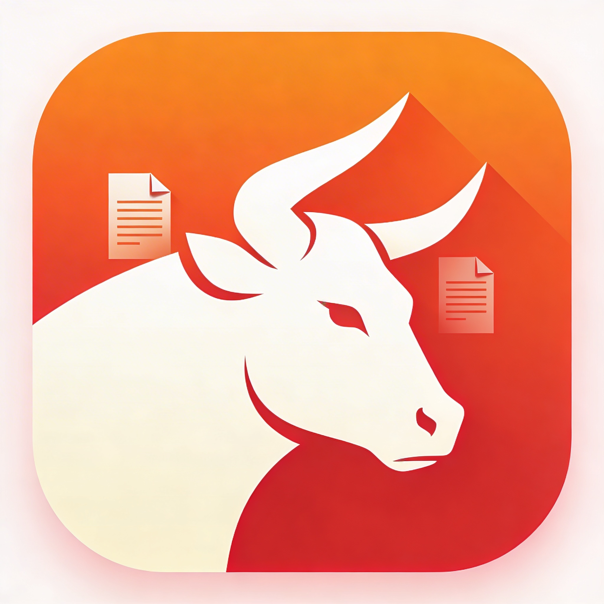
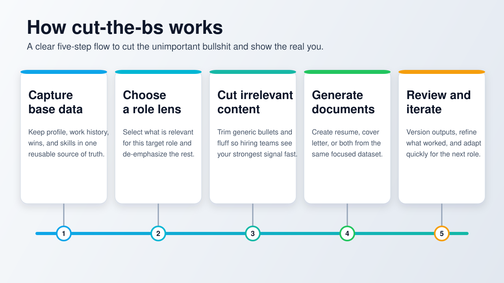
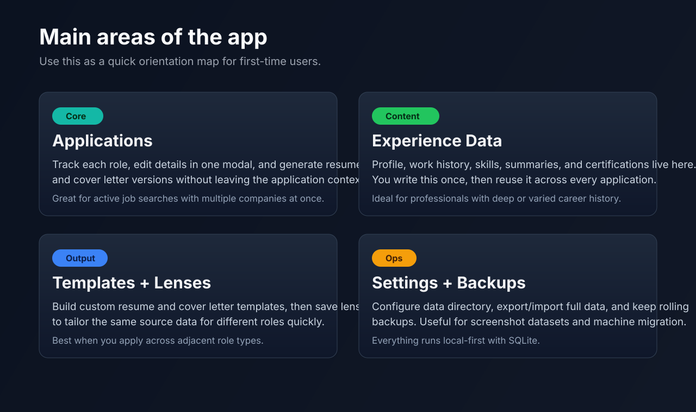
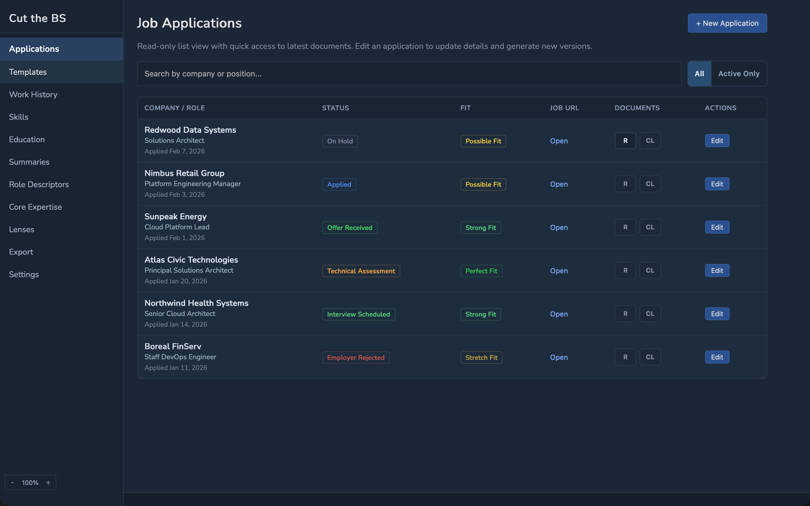
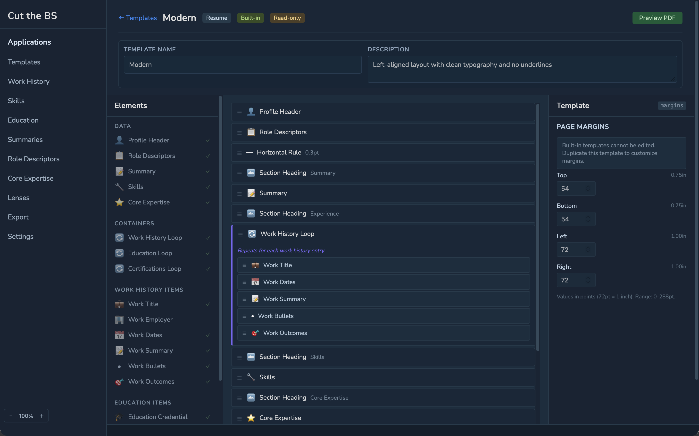
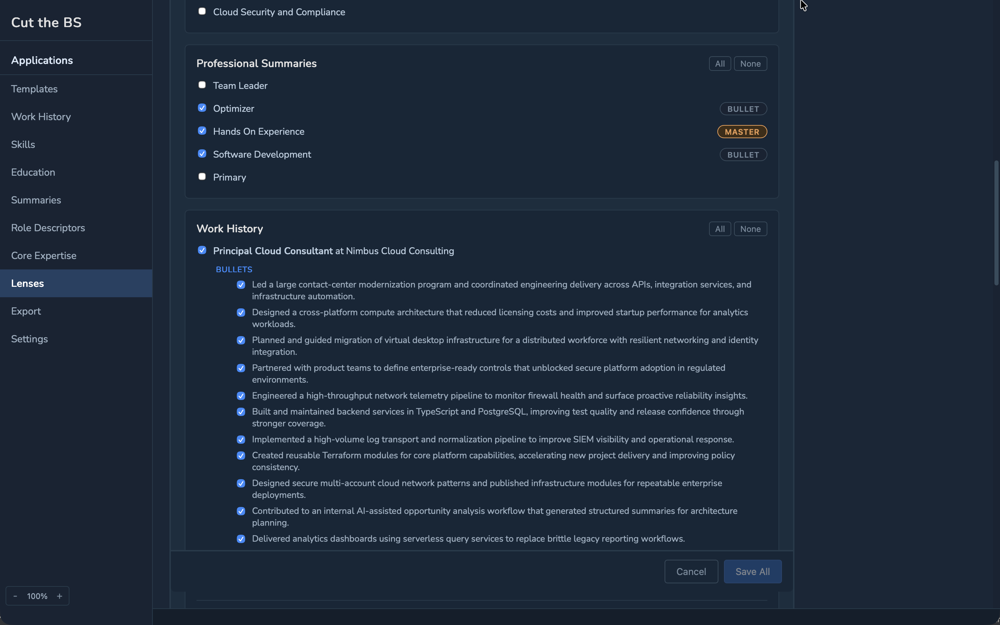
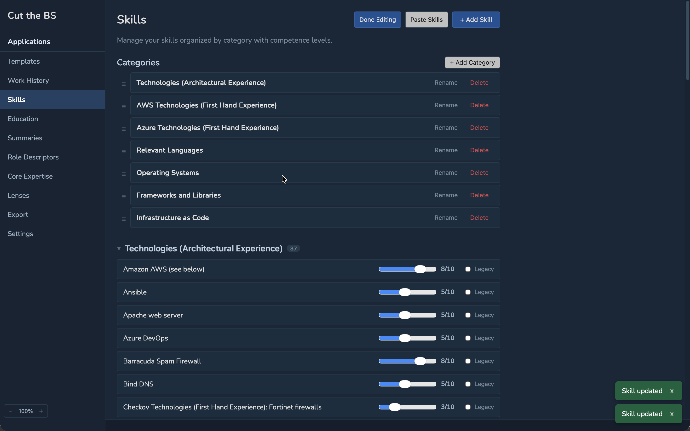
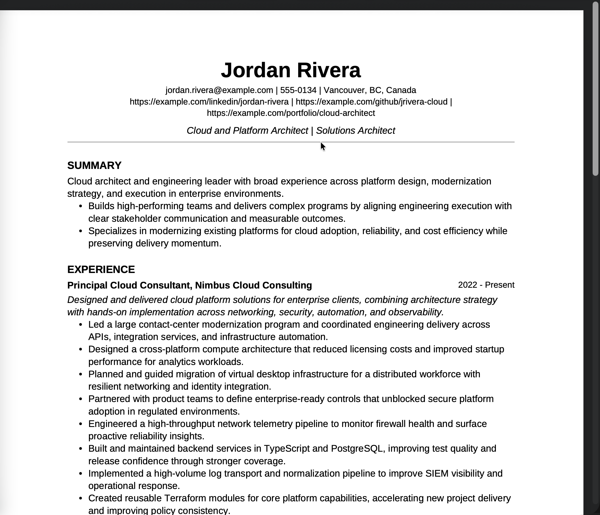

# cut-the-bs

<p align="center">
  
</p>

<p align="center">
  <a href="https://github.com/bradhannah/cut-the-bs/releases"></a>
  <a href="https://github.com/bradhannah/cut-the-bs/actions/workflows/ci.yml"></a>
  <a href="https://github.com/bradhannah/cut-the-bs/releases"></a>
  <a href="https://github.com/bradhannah/cut-the-bs/stargazers"></a>
  <a href="LICENSE"></a>
</p>

<p align="center">
  
  
  
  
  
  
  
</p>

"Cut the Bullsh*t" (`cut-the-bs`) is a desktop app for people who tailor resumes and cover letters often.

It is called that because it helps you cut the unimportant bullshit from your resume and cover letter so hiring teams can see the real you.

It is built for practical job-search work: keep your experience data in one place, target each application cleanly, and generate role-specific documents without copy-paste chaos.

<p>
  
</p>

## Who this is for

- Engineers, architects, consultants, and technical leads applying across multiple related roles.
- People with deep work history who need selective, role-specific storytelling.
- Anyone who wants local-first data ownership (SQLite on your machine, no web account required).

## Why people use it

- Job applications become the center of the workflow, so each resume/cover letter pair stays tied to a specific role.
- Lenses let you reuse your core experience but change emphasis quickly.
- Templates are customizable enough to support both conservative and modern formats.
- Versioned exports make it easy to iterate instead of rewriting from scratch every time.

## What it does

- **Experience source of truth**: profile, work history, bullets, skills, summaries, certs, and more.
- **Application tracking**: status timeline, fit indicator, notes, posting URL, and linked document versions.
- **Resume + cover letter generation**: create new versions or overwrite latest per application.
- **Template builder**: built-in templates (view-only) plus user templates you can duplicate and edit.
- **Data controls**: configurable data directory, full export/import, and rolling backups.

<p>
  
</p>

## Screenshots

Here are real screens from the app so people can see what daily use actually looks like.

### Applications-first workflow

<p>
  
</p>

### Build a targeted resume

<p>
  
</p>

### Lenses for role-specific emphasis

<p>
  
</p>

### Skills depth and categorization

<p>
  
</p>

### Example generated resume output

<p>
  
</p>

## Install on macOS (Homebrew)

```bash
brew tap bradhannah/cut-the-bs https://github.com/bradhannah/cut-the-bs
brew install --cask cut-the-bs
```

Upgrade:

```bash
brew upgrade --cask --greedy cut-the-bs
```

Uninstall:

```bash
brew uninstall --cask cut-the-bs
brew zap cut-the-bs
```

Note: the app is currently unsigned. If Gatekeeper blocks launch:

```bash
xattr -dr com.apple.quarantine "/Applications/cut-the-bs.app"
```

## Screenshot-safe sample data

You can point the app to a separate data directory for demos/screenshots.

- Open `Settings` -> `Data Management`.
- Set `Data Directory` to your sample folder.
- Save and restart.

This keeps personal data and demo data fully separate.

## Developer setup (macOS)

```bash
brew bundle --file Brewfile
make setup
make dev
```

## ATS compatibility checks

You can validate both generated resumes and cover letters with automated tests and a local PDF checker.

Run ATS integration tests:

```bash
go test ./tests/integration -run ATS -count=1
```

Or use the Make target:

```bash
make test-ats
```

Run the local checker against a real exported PDF:

```bash
go run ./cmd/atscheck --pdf "/path/to/generated.pdf"
```

Add expected content and reading-order checks:

```bash
go run ./cmd/atscheck \
  --pdf "/path/to/generated.pdf" \
  --require "Jane Smith" \
  --require "Acme Robotics" \
  --order "Jane Smith>Experience>Acme Robotics"
```

Shortcut Make targets:

```bash
make atscheck PDF="/path/to/generated.pdf"
make atscheck-resume PDF="/path/to/resume.pdf"
make atscheck-cover-letter PDF="/path/to/cover-letter.pdf"
```

You can append extra checks to Make targets with `ATS_ARGS`, for example:

```bash
make atscheck-resume PDF="/path/to/resume.pdf" ATS_ARGS='--require "Acme Robotics" --order "Summary>Experience"'
```

## Release and Homebrew maintenance

See `HOMEBREW.md` for the release checklist, cask details, and workflow notes.
